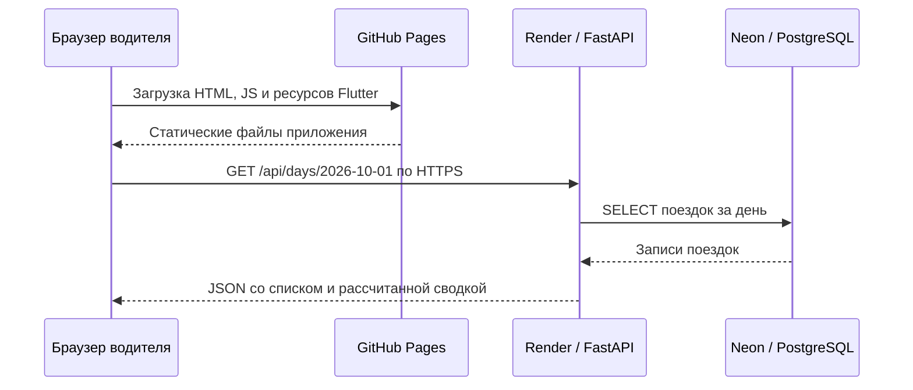

# Как связаны GitHub Pages, Render и Neon

Приложение состоит из Flutter Web, FastAPI и PostgreSQL. Названия хостингов не зашиты в бизнес-логику: адрес API задаётся при сборке клиента, подключение к PostgreSQL — окружением сервера.



Pages участвует в загрузке приложения. Последующие запросы данных идут из браузера прямо в Render. Сервер выполняет SQL-запросы к Neon; браузер не получает доступ к PostgreSQL.

## 1. Адрес Render попадает во Flutter при сборке

В [.github/workflows/pages.yaml](../.github/workflows/pages.yaml) repository variable `API_BASE_URL` передаётся в окружение сборки. Команда `flutter build web` получает:

```bash
--dart-define="API_BASE_URL=$API_BASE_URL"
--dart-define=API_READ_TIMEOUT_SECONDS=90
```

Значение для демо — `https://arqaminiproject.onrender.com`. Оно включается в публичный JavaScript, поэтому здесь нет паролей и ключей базы. Изменение переменной GitHub требует новой сборки.

В [frontend/lib/api.dart](../frontend/lib/api.dart) конструктор `DiaryApi` читает адрес:

```dart
const String.fromEnvironment(
  'API_BASE_URL',
  defaultValue: 'http://localhost:8000',
)
```

`getDay()` выполняет HTTP GET на `$_baseUrl/api/days/${dateKey(day)}`, а `createTrip()` — POST на `$_baseUrl/api/trips` с JSON. Возвращаемый JSON преобразуется в `DayData` или `Trip` из [models.dart](../frontend/lib/models.dart).

Параметр `--base-href` в workflow задаёт путь самого сайта: для GitHub Pages проекта это `/arqaMiniProject/`. Он нужен для загрузки ресурсов Flutter и не добавляется к URL API.

## 2. FastAPI разрешает запросы браузера с Pages

Сайт и API имеют разные origin. В [backend/app/config.py](../backend/app/config.py) `Settings` читает `CORS_ORIGINS` из окружения; [backend/app/main.py](../backend/app/main.py) передаёт список в `CORSMiddleware`:

```python
app.add_middleware(
    CORSMiddleware,
    allow_origins=get_settings().cors_origins,
    allow_methods=["GET", "POST"],
    allow_headers=["Content-Type"],
)
```

На Render задано `CORS_ORIGINS=["https://jjigaev.github.io"]`. Origin содержит схему и домен, без пути `/arqaMiniProject/`. Для POST с JSON браузер может предварительно отправить OPTIONS; middleware обрабатывает этот запрос автоматически.

CORS определяет, разрешено ли браузеру читать ответ другого origin. Это не авторизация: API демонстрационного приложения публичный, без учётных записей пользователей.

## 3. FastAPI подключается к Neon через SQLAlchemy

`Settings.database_url` в [config.py](../backend/app/config.py) получает серверную переменную `DATABASE_URL`. Префикс `postgresql+psycopg://` выбирает PostgreSQL и установленный драйвер psycopg; пароль и TLS-параметры берутся из строки Neon.

В [backend/app/database.py](../backend/app/database.py) `get_engine()` создаёт и кеширует SQLAlchemy engine:

```python
return create_engine(get_settings().database_url, pool_pre_ping=True)
```

`pool_pre_ping=True` проверяет соединение при выдаче из пула, позволяя обнаружить устаревшие подключения. `get_session()` открывает ORM-сессию для запроса и закрывает её после обработки. В [main.py](../backend/app/main.py) она внедряется в обработчики через `Depends(get_session)`.

Neon предоставляет обычный PostgreSQL: код не вызывает Neon REST API, Object Storage или MCP. Эти инструменты не участвуют в работе приложения. Для локального запуска тот же SQLAlchemy-код подключается к PostgreSQL из [compose.yaml](../compose.yaml).

## 4. Что происходит при выборе дня

1. `DiaryController.selectDate()` в [diary_controller.dart](../frontend/lib/diary_controller.dart) вызывает `repository.getDay()`. Счётчик `_request` не даёт запоздавшему ответу заменить данные нового выбранного дня.
2. `DiaryApi.getDay()` отправляет GET в Render.
3. `get_day()` в [main.py](../backend/app/main.py) проверяет дату и вызывает `read_day(session, day)`.
4. `read_day()` в [services.py](../backend/app/services.py) определяет границы дня в `Asia/Qyzylorda`, переводит их в UTC и выбирает поездки по времени начала. Из одного набора формируются список и сводка через `summarize()`.
5. FastAPI сериализует деньги как десятичные строки. Flutter преобразует их в целые minor units и обновляет экран.

## 5. Что происходит при добавлении поездки

1. `DiaryController.saveTrip()` создаёт UUID и фиксирует payload в `pendingTrip`.
2. `DiaryApi.createTrip()` отправляет POST в Render. Pydantic-схема `TripInput` из [schemas.py](../backend/app/schemas.py) проверяет деньги, timestamps и способ оплаты.
3. `post_trip()` вызывает `create_trip()` из [services.py](../backend/app/services.py). PostgreSQL выполняет `INSERT ... ON CONFLICT DO NOTHING` по первичному ключу `id`.
4. Новая запись возвращает 201. При существующем ID данные сравниваются: совпадение возвращает 200, отличие — 409 без перезаписи. Успешная транзакция фиксируется через `session.commit()`; при конфликте выполняется rollback.
5. После успеха контроллер очищает `pendingTrip` и заново загружает день поездки. Если результат POST неопределён, ID и данные сохраняются для повтора; PostgreSQL не создаёт дубль.

## 6. Запуск и обновление серверной части

[backend/Dockerfile](../backend/Dockerfile) копирует `backend/` и `data/`, устанавливает Python-зависимости и выполняет последовательно:

```sh
alembic upgrade head
python -m app.seed /data/trips.json
uvicorn app.main:app --host 0.0.0.0 --port 8000
```

В CMD команды соединены через `&&`: при ошибке миграции или импорта HTTP-сервер не стартует. Alembic в [migrations/env.py](../backend/migrations/env.py) использует тот же `get_engine()` и `DATABASE_URL`. Поэтому на Render задан прямой URL Neon, подходящий для миграций; импорт повторяем и не создаёт дубли.

[render.yaml](../render.yaml) описывает Docker-сервис, секретную переменную `DATABASE_URL`, CORS и health check `/docs`. Автоматические deploy в этой конфигурации отключены: после push сервер обновляется вручную в Render. Изменение Flutter запускает отдельный workflow Pages; обновление интерфейса само по себе не обновляет FastAPI или схему БД.
